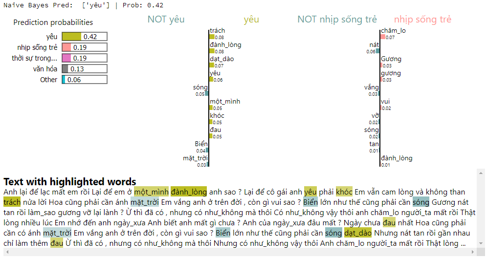
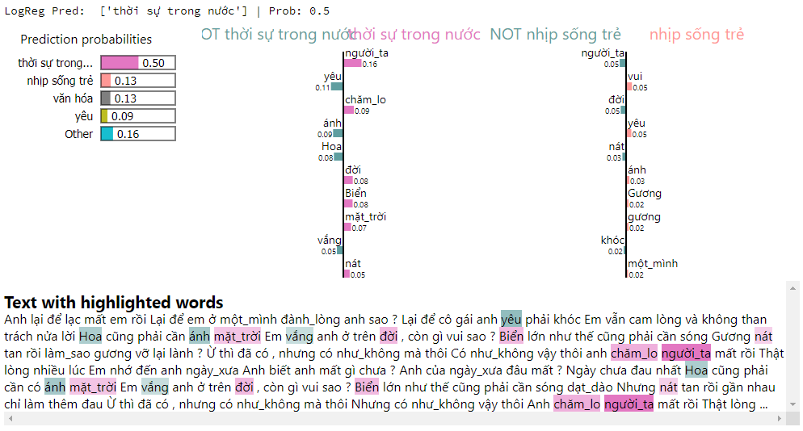
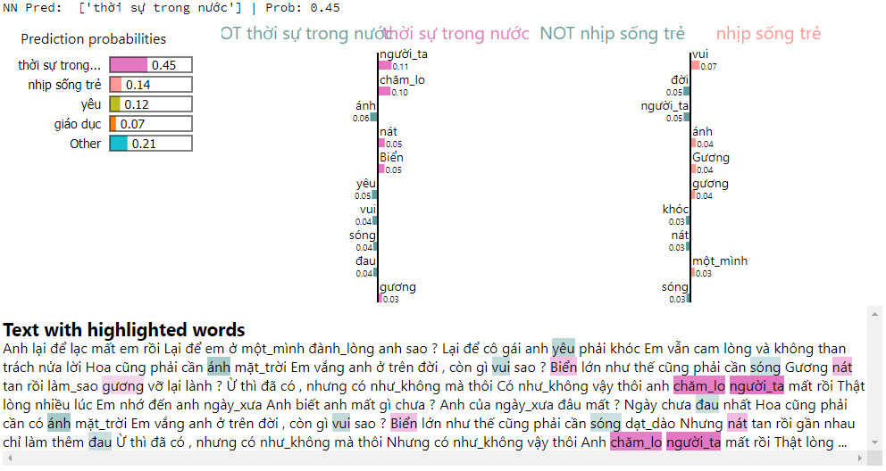
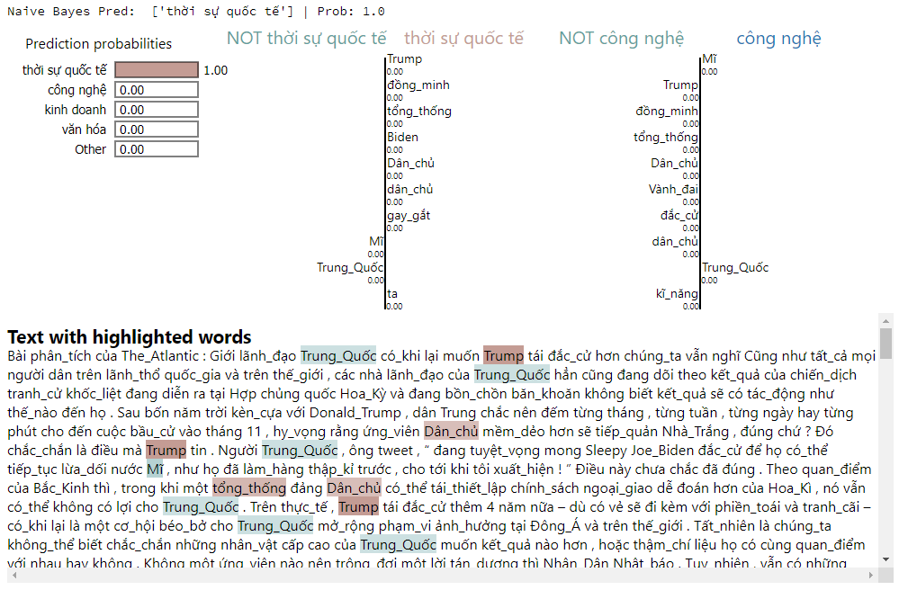
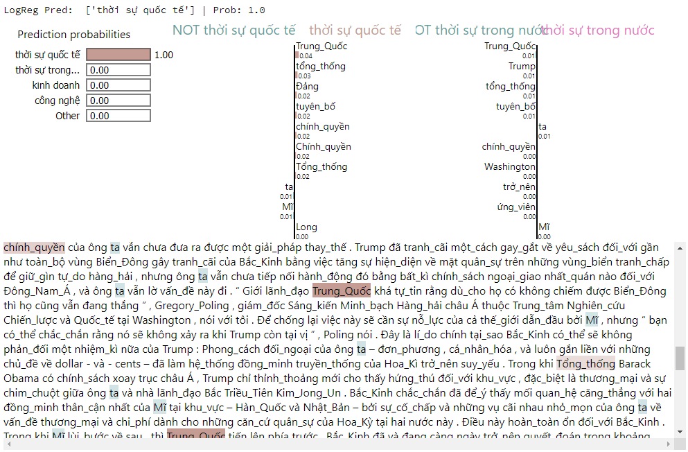
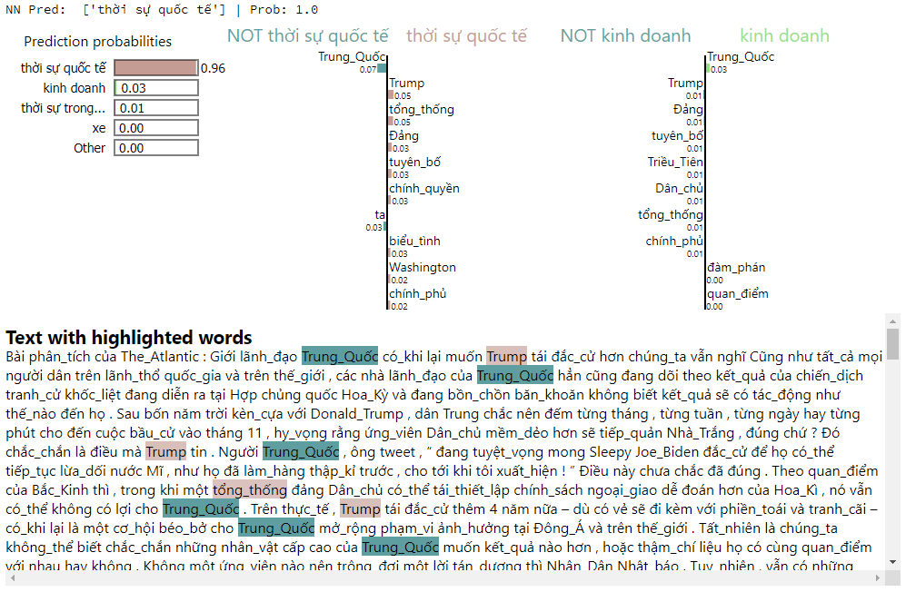

# Đồ án cuối kỳ môn Nhập môn khoa học dữ liệu
## Thông tin nhóm 12
|**Thành viên**|**MSSV**|
|:- | --- |
|Vũ Đăng Hoàng Long|18120203|
|Nguyễn Huỳnh Đại Lợi|18120198|
  
---
# Tổng quan đề tài

Trên không gian Internet, *dữ liệu dạng chữ xuất hiện rộng khắp* (blog, mạng xã hội, báo,...). Do tính chất của ngôn ngữ tự nhiên, việc tận dụng các nguồn dữ liệu này thường không đơn giản. Với vấn đề này, ý tưởng của nhóm là xây dựng một mô hình giúp nhận diện chủ đề của văn bản bất kỳ với nguồn dữ liệu học là báo mạng. Với mô hình này, nhóm hi vọng có thể giúp cho việc tận dụng nguồn dữ liệu khổng lồ này được dễ dàng hơn khi có thể biến từ cả một văn bản dài thành chỉ còn chủ đề của chúng.

*Tại sao chọn báo mạng*? Thứ nhất, với đặc thù phải thường xuyên cập nhật thông tin đến với đọc giả, mỗi giờ có hàng trăm, hàng ngàn bài báo được đưa lên khiến cho báo mạng là một kho dữ liệu khổng lồ. Thứ hai, mỗi bài báo được đưa lên đều có một chuyên mục nhất định, do vậy sẽ không cần phải quá mất công để gán nhãn cho các bài báo. Và cuối cùng, là một trang báo, các bài viết thường sẽ có chất lượng và đảm bảo về ngữ nghĩa cũng như ngữ pháp.

---
# Cụ thể đồ án

**Chủ đề**: Nhận diện chủ đề của một đoạn văn bản bất kỳ.

**Input**: một đoạn văn bản bất kỳ.

**Output**: một trong 18 phân lớp chủ đề sau:

| | | |
| :- | :- | :- |
| 1. thời sự quốc tế | 2. thời sự trong nước | 3. du lịch |
| 4. kinh doanh | 5. giải trí | 6. công nghệ |
| 7. nhà đất | 8. sức khỏe | 9. giáo dục |
| 10. khoa học | 11. thể thao | 12. văn hóa |
| 13. pháp luật | 14. yêu | 15. xe |
| 16. thời trang | 17. nhịp sống trẻ | 18. ăn gì |

**Nguồn dữ liệu**: tất cả bài báo thu thập từ trang báo điện tử [Tuổi trẻ Online](https://tuoitre.vn/).

**Ý tưởng**:
- Khách quan: phục vụ việc nhận diện chủ đề một cách tự động.
- Chủ quan: lọc các bài viết trên mạng xã hội theo chủ đề mà em quan tâm để tránh lãng phí thời gian lướt facebook chỉ để tìm chủ đề mà em quan tâm 🥴.

---
# Một số hình ảnh demo model
(sử dụng [LIME](https://github.com/marcotcr/lime) để trực quan hóa)

## Test 1: lời bài hát "Có như không có" của ca sĩ Hiền Hồ
### Mô hình Naive Bayes

Cũng ổn 👌  

### Mô hình Logistic Regression

🤡  

### Mô hình Bagging MLP

🤡🤡🤡  

## Test 2: một bài bình luận chính trị quốc tế lấy từ group kín trên Facebook
### Mô hình Naive Bayes

👌👀💅  

### Mô hình Logistic Regression

👌👀💅  

### Mô hình Bagging MLP

👌👀💅  

---
# Tổ chức github
## Folders
- report/ : chứa file báo cáo quá trình làm việc và powerpoint. 
- resources/ : chứa hình ảnh trong notebook Final.ipynb. 
- src/ : chứa data thu thập được, notebook phát sinh trong quá trình làm việc nhóm để trao đổi. 
## Files
- `Final.ipynb`: notebook chính dùng để báo cáo, nêu chi tiết về quá trình thực hiện đồ án của nhóm. 
- `Demo_Model.ipynb`: notebook này dự tính sẽ lấy các pickle của model đã train sẵn từ file final.ipynb để phục vụ dự đoán đoạn văn bản ngẫu nhiên. 
- `Batch_process.ipynb`: notebook chứa các đoạn code dùng phục vụ cho việc xử lý dữ liệu hàng loạt (do công việc này tốn thời gian và cần đoạn code dài dòng nên nhóm loại khỏi notebook chính để tránh gây rối). 
- `Slide.pdf`: bản pdf của powerpoint để coi tránh lỗi font, hình,... 

---
# Tham khảo
- Các notebook demo và bài tập của thầy.
- Cách crawl dữ liệu với web dạng infinity scroll ([`Link`](https://www.scraping-bot.io/how-to-scrape-infinite-scroll-pages/)).
- Cách sửa lỗi exceeded 30 redirects ([`Link`](https://prodevsblog.com/questions/128808/python-requests-requests-exceptions-toomanyredirects-exceeded-30-redirects/)).
- Hướng dẫn phân loại tin tức và trực quan hóa ([`Link`](https://towardsdatascience.com/text-classification-with-nlp-tf-idf-vs-word2vec-vs-bert-41ff868d1794)).
- Hướng dẫn phân loại tin tức tiếng Việt ([`Link`](https://nguyenvanhieu.vn/phan-loai-van-ban-tieng-viet/))).
- Giới thiệu tiền xử lý trong tiếng Việt ([`Link`](https://kipalog.com/posts/Gioi-thieu-tien-xu-ly-trong-xu-ly-ngon-ngu-tu-nhien)).
- Hướng dẫn chuẩn hóa unicode nhanh ([`Link`](https://quan.hoabinh.vn/blog/2020/7/85-chuyen-doi-unicode-dung-san-to-hop-voi-python)).
- Giới thiệu về LIME ([`Link`](https://rpubs.com/lengockhanhi/314349)).
- Document của scikit-learn, pandas, tqdm, pandarallel.
Và hằng hà sa số câu trả lời cho những câu hỏi ~~ngu ngốc~~ của nhóm trên stackoverflow và google.
